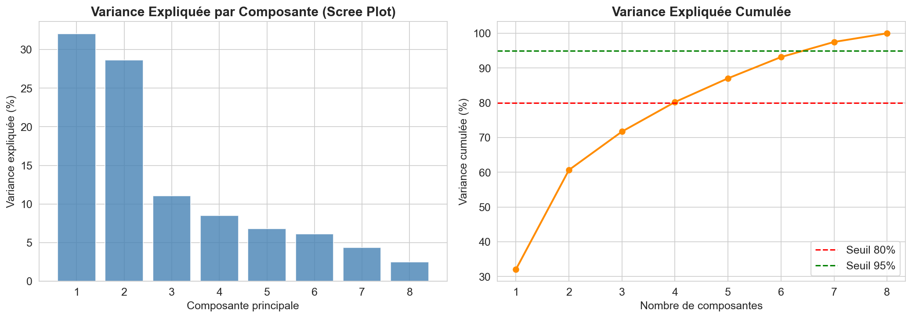
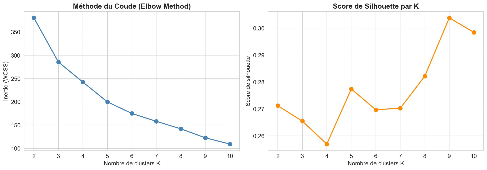
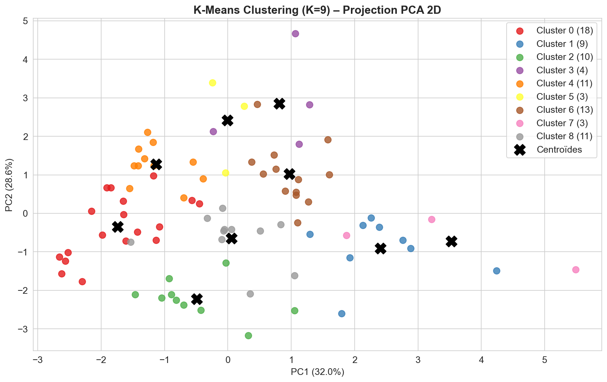
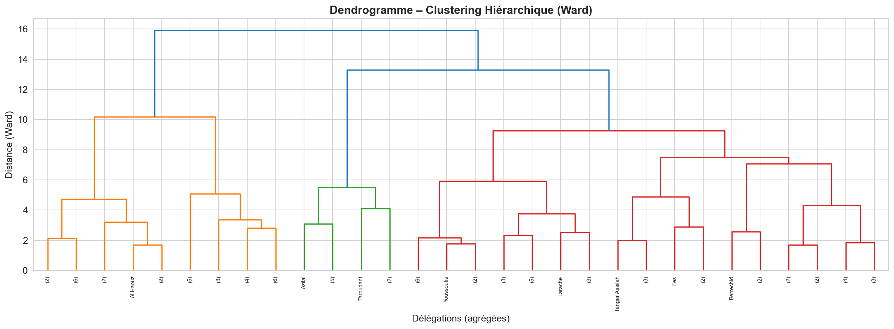
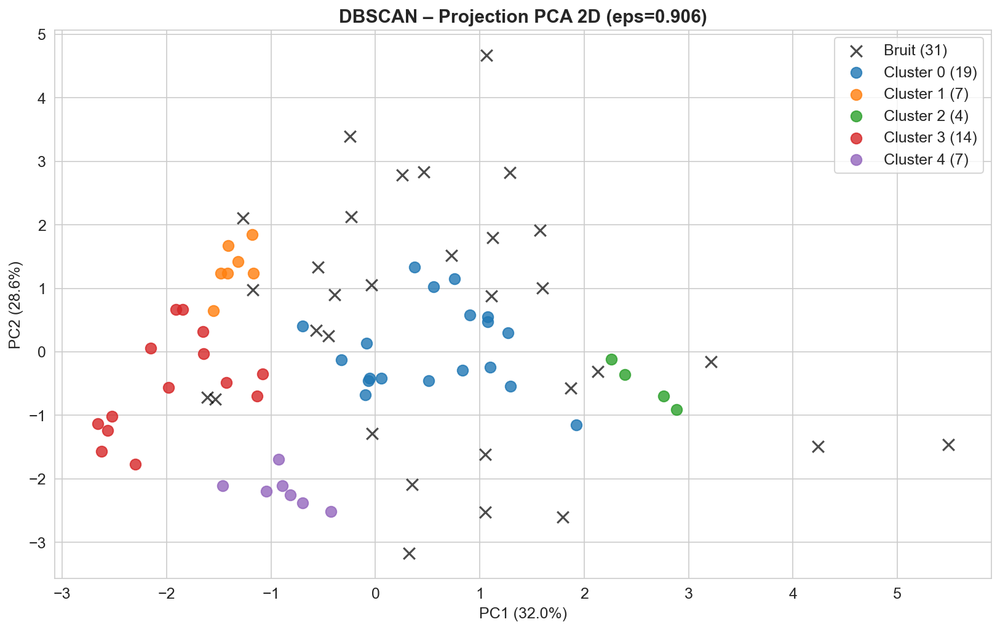
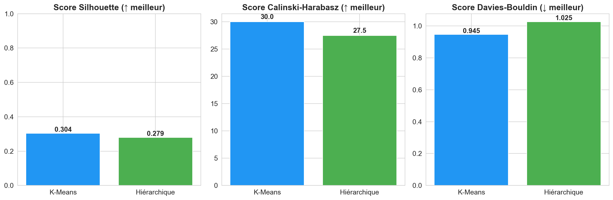

# 🏥 Clustering des Établissements de Soins de Santé Primaire au Maroc (2024)

> **Projet Machine Learning – Apprentissage Non-Supervisé**  
> Université Cadi Ayyad · Faculté des Sciences Semlalia · ISI S6 · 2025–2026

---

## 📌 Description

Ce projet applique les algorithmes de **clustering non-supervisé** sur le dataset des établissements de soins de santé primaire au Maroc (2024) pour identifier des regroupements naturels parmi les **82 délégations sanitaires** selon leur profil d'offre de soins.

**Source des données :** [data.gov.ma – Portail National des Données Ouvertes](https://data.gov.ma/data/fr/dataset/la-liste-des-hopitaux/resource/eedbf07a-29fb-4442-b504-37c152ba9402)

---

## 📊 Dataset

| Attribut | Valeur |
|---|---|
| Établissements | 3 224 |
| Délégations | 82 |
| Régions | 12 |
| Variables | 7 (toutes catégorielles) |
| Types d'établissements | 8 (CSR-1, DR, CSU-1, CSR-2, CSU-2, CDTMR, CRSR, LSP) |

---

## 🔄 Pipeline ML

```
Données brutes (Excel)
        ↓
Prétraitement : Pivot délégation × catégorie + StandardScaler
        ↓
Réduction de dimensionnalité : PCA (4 composantes → 80.2% variance)
        ↓
┌─────────────┐   ┌──────────────────────┐   ┌─────────────┐
│   K-Means   │   │  Clustering          │   │   DBSCAN    │
│   K = 9     │   │  Hiérarchique (Ward) │   │ eps = 0.906 │
└─────────────┘   └──────────────────────┘   └─────────────┘
        ↓
Évaluation : Silhouette · Calinski-Harabasz · Davies-Bouldin
```

---

## 🤖 Algorithmes & Résultats

### PCA
- **4 composantes** retenues → **80.2%** de variance expliquée



---

### K-Means (K=9)
- K optimal déterminé par la **méthode du coude** + **score de silhouette**




---

### Clustering Hiérarchique (Ward)
- Dendrogramme révèle **2 grands groupes** : rural vs urbain



---

### DBSCAN (eps=0.906, min_samples=3)
- **5 clusters** denses + **31 délégations anomaliques** détectées



---

## 📈 Comparaison des Algorithmes

| Algorithme | Nb. Clusters | Silhouette ↑ | Calinski-Harabasz ↑ | Davies-Bouldin ↓ |
|---|---|---|---|---|
| **K-Means** | 9 | 0.3039 | 30.01 | 0.9453 |
| **Hiérarchique (Ward)** | 9 | 0.2792 | 27.51 | 1.0251 |
| **DBSCAN**  | 5 | **0.3552** | **33.54** | **0.7978** |

> **DBSCAN** obtient les meilleures métriques sur les clusters denses.  
> K-Means reste le plus interprétable avec 9 groupes bien définis.



---

## 🔍 Interprétation

- **Profil rural** : délégations à forte proportion de CSR-1 et DR
- **Profil urbain** : délégations dominées par CSU-1/CSU-2
- **Profil atypique** : grandes métropoles (Casablanca, Marrakech, Rabat, Fès...) détectées par DBSCAN

---

## ⚙️ Installation & Exécution

```bash
# Cloner le repo
git clone https://github.com/Houda-hub/ml-sante-primaire-maroc.git
cd ml-sante-primaire-maroc

# Installer les dépendances
pip install pandas numpy matplotlib seaborn scikit-learn scipy openpyxl

# Lancer le notebook
jupyter notebook ml_sante_primaire.ipynb
```

---

## 📁 Structure du Repo

```
├── ml_sante_primaire.ipynb                               # Notebook principal
├── etablissements-de-soins-de-sante-primaire-2024.xlsx   # Dataset
├── resultats_clustering.csv                              # Résultats exportés
├── fig1_distribution.png                                 # Distribution des catégories
├── fig3_pca_variance.png                                 # Scree plot PCA
├── fig5_kmeans_elbow.png                                 # Elbow + Silhouette
├── fig6_kmeans_clusters.png                              # Clusters K-Means
├── fig8_dendrogramme.png                                 # Dendrogramme
├── fig10_dbscan_kdist.png                                # K-Distances DBSCAN
├── fig11_dbscan_clusters.png                             # Clusters DBSCAN
├── fig12_comparaison.png                                 # Comparaison métriques
└── README.md
```

---

## 👤 Auteur

| | |
|---|---|
| **Étudiante** | Beddach Houda |
| **Filière** | Ingénierie des Systèmes Informatiques – S6 |
| **Encadrant** | Pr. Fahd Kalloubi |
| **Université** | Cadi Ayyad – Faculté des Sciences Semlalia |
| **Année** | 2025 – 2026 |
